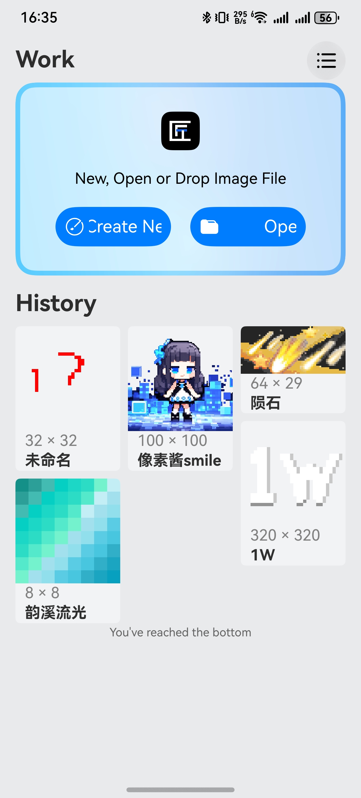

# Practice of Loading Waterfall Flow Data from Files in HarmonyOS 
## Practice of Loading Waterfall Flow Data from Files in HarmonyOS - Taking the Implementation of Waterfall Flow in the PixelArtisan Painting Works History Project as an Example

### I. Application and Project Overview
PixelArtisan is an exquisite and agile pixel art editor for HarmonyOS, offering over 30 drawing tools for pixel art creation. It supports features such as one-to-many layouts and dark mode.



This article takes the historical painting projects of PixelArtisan as an example to introduce how to load waterfall flow data from files.

### II. Related Technologies and APIs
WaterFlow Component: Used for implementing the waterfall flow layout.
Canvas Component: Utilized for drawing due to the generally low resolution of pixel art. Using the Image component may result in blurry previews due to anti-aliasing. For normal resolution images, the Image component is recommended.

LazyForEach: Enables lazy loading of items in the waterfall flow.
File Management: @ohos.file.fs API for file operations.
Component Size Monitoring: For dynamically adjusting layouts based on component dimensions.

### III. Implementation of Waterfall Flow Data and Lazy Loading Interface Objects
Data Objects

The data objects include:
|Property| Name	Type|	Purpose|
|--|--|--|
|view|	ImageBitmap|	Image data object used for displaying preview images.|
|name|	string|	The name of the project.|
|sid|	number|	The unique ID of the project.|
|content|	CanvasRenderingContext2D|	Used for drawing on the Canvas.|
|lock|	boolean|	Used to determine if the project is locked.|

```arkts
interface Work {
  view: ImageBitmap
  name: string,
  sid: number,
  context: CanvasRenderingContext2D,
  lock: boolean
}
```
### 1. Implementation of Lazy Loading Interface for IDataSource

Purpose of Using Lazy Loading

> The LazyForEach iterates through data from the provided data source on demand and creates corresponding components during each iteration. When LazyForEach is used within a scrolling container, the framework creates components as needed based on the visible area of the scrolling container. When a component scrolls out of the visible area, the framework destroys and recycles it to reduce memory consumption.

### 2. Interface Implementation (English Translation)

```arkts
// An object implementing the IDataSource interface for loading data in a waterfall flow component
class WaterFlowDataSource implements IDataSource {
  private dataArray: Work[] = [];
  private listeners: DataChangeListener[] = [];

  // Set the data array
  public setDataArray(works: Work[]) {
    this.dataArray = works;
  }

  // Get the data corresponding to the given index
  public getData(index: number): Work {
    return this.dataArray[index];
  }

  // Get the total count of data items
  public totalCount(): number {
    return this.dataArray.length;
  }

  // Register a listener for data changes
  registerDataChangeListener(listener: DataChangeListener): void {
    if (!this.listeners.includes(listener)) {
      this.listeners.push(listener);
    }
  }

  // Unregister a listener for data changes
  unregisterDataChangeListener(listener: DataChangeListener): void {
    const pos = this.listeners.indexOf(listener);
    if (pos >= 0) {
      this.listeners.splice(pos, 1);
    }
  }

  // Notify listeners that the data has been reloaded
  notifyDataReload(): void {
    this.listeners.forEach(listener => {
      listener.onDataReloaded();
    });
  }

  // Notify listeners that data has been added at the given index
  notifyDataAdd(index: number): void {
    this.listeners.forEach(listener => {
      listener.onDataAdd(index);
    });
  }

  // Notify listeners that data has changed at the given index
  notifyDataChange(index: number): void {
    this.listeners.forEach(listener => {
      listener.onDataChange(index);
    });
  }

  // Notify listeners that data has been deleted at the given index
  notifyDataDelete(index: number): void {
    this.listeners.forEach(listener => {
      listener.onDataDelete(index);
    });
  }

  // Add an item to the data array at the specified index
  public addItem(index: number, newWork: Work): void {
    this.dataArray.splice(index, 0, newWork);
    this.notifyDataAdd(index);
  }

  // Reload the data with a new array
  public reload(works: Work[]): void {
    this.dataArray = works;
    this.notifyDataReload();
  }

  // Delete an item with the given sid
  public delItem(sid: number, rootPath: string) {
    if (fs.accessSync(rootPath + '/Project/' + sid + '/LOCK')) {
      return false;
    }
    let delIndex = -1;
    for (let i = 0; i < this.dataArray.length; i++) {
      if (this.dataArray[i].sid === sid) {
        this.dataArray.splice(i, 1);
        delIndex = i;
        break;
      }
    }
    if (delIndex !== -1) {
      this.notifyDataDelete(delIndex);
      return true;
    }
    return false;
  }

  // Set the top item's sid
  public setTopSid(sid: number) {
    this.dataArray[0].sid = sid;
  }

  // Update the lock status of an item with the given sid
  public updateLockItem(sid: number, lock: boolean) {
    let index = -1;
    for (let i = 0; i < this.dataArray.length; i++) {
      if (this.dataArray[i].sid === sid) {
        this.dataArray[i].lock = lock;
        index = i;
        break;
      }
    }
    if (index !== -1) {
      this.notifyDataChange(index);
      return true;
    }
    return false;
  }

  // Update the name of an item with the given sid
  public updateNameItem(sid: number, name: string) {
    let index = -1;
    for (let i = 0; i < this.dataArray.length; i++) {
      if (this.dataArray[i].sid === sid) {
        this.dataArray[i].name = name;
        index = i;
        break;
      }
    }
    if (index !== -1) {
      this.notifyDataChange(index);
      return true;
    }
    return false;
  }
}
```

### IV Variable Declaration and Lifecycle
### 1.Related (State) Variables

```arkts
  private rootPath = this.uiContent.filesDir
  private dataArray: Work[] = [];
  @State dataSource: WaterFlowDataSource = new WaterFlowDataSource()
  @StorageLink('needUpdateWaterFlowData') needUpdateWaterFlowData: number = -1
  @StorageLink('importProjectWatcher') @Watch('onProjectImporting') importProjectWatcher: boolean = false
  @State waterFlowSingleWith: number = 160
  ```

  rootPath: The application sandbox path

dataArray: The initial waterfall flow data

dataSource: The waterfall flow data object

needUpdateWaterFlowData: The ID of the waterfall flow data that needs to be updated

importProjectWatcher: A state listener for reading in new data, which can be updated from other components/pages

waterFlowSingleWidth: The width of a single child component in the waterfall flow

### 2.Component Lifecycle Methods:

Read the initial waterfall flow data content from a file, and set needUpdateWaterFlowData and importProjectWatcher as global variables.

```arkts
  aboutToAppear() {
    this.initWaterFlow();
    AppStorage.setOrCreate("needUpdateWaterFlowData", this.needUpdateWaterFlowData);
    AppStorage.setOrCreate("importProjectWatcher", this.importProjectWatcher);
  }

  async initWaterFlow() {
    this.dataArray = [];
    const maxSid = await NeoPreferencesUtil.getPreferencesValue('NeoPaint', 'maxSid', 0) as number;
    for (let i = 0; i <= maxSid; i++) {
      if (fs.accessSync(this.rootPath + '/Project/' + i + '/view.png')) {
        const img = new ImageBitmap(fileUri.getUriFromPath(this.rootPath + '/Project/' + i + '/view.png'));
        let historyData: HistoryData =
          JSON.parse(fs.readTextSync(this.rootPath + '/Project/' + i + '/projectInfo.json'));
        this.dataArray.push({
          view: img,
          sid: i,
          context: new CanvasRenderingContext2D(this.setting),
          name: historyData.name,
          lock: fs.accessSync(this.rootPath + '/Project/' + i + '/LOCK')
        })
        // ...
      }
    }
    this.dataSource.setDataArray(this.dataArray.reverse());
  }
  ```

  When calling the this.dataSource.setDataArray method, reverse the array vertically so that newer project data appears at the front.

### V. ArkUI Waterfall Flow Implementation

Here's how to implement a waterfall flow in ArkUI where child components have varying sizes based on image dimensions:

Use the onSideChange event to listen for changes in component size, and use the componentUtils.getRectangleById method to obtain the width of the component.

Below is the implementation of the waterfall flow component. Pay attention to properly using the itemGenerator to set the generation function for the waterfall flow's child components (otherwise, data might not update correctly during lazy loading of the waterfall flow):

```arkts
  @Builder
  WorkWaterFlow() {
    Column({ space: 2 }) {
      WaterFlow({ footer: (): void => this.itemFoot(), scroller: this.scroller }) {
        LazyForEach(this.dataSource, (item: Work, index: number) => {
          FlowItem() {
            Column() {
              Canvas(item.context)
                .width('100%')
                .height(Math.min(this.getUIContext()
                  .px2vp(this.waterFlowSingleWith / item.view.width * item.view.height), 200))
                .onReady(() => {
                  item.context.imageSmoothingEnabled = false; 
                  const img = item.view;
                  item.context.drawImage(img, 0, 0, img.width, img.height, 0, 0, item.context.width,
                    item.context.width / img.width * img.height)
                })
                .onSizeChange(() => {
                  this.waterFlowSingleWith = componentUtils.getRectangleById('waterFlowSingle' + item.sid).size.width;
                  item.context.clearRect(0, 0, item.context.width, item.context.height);
                  item.context.imageSmoothingEnabled = false;
                  const img = item.view;
                  item.context.drawImage(img, 0, 0, img.width, img.height, 0, 0, item.context.width,
                    item.context.width / img.width * img.height)
                })
                .expandSafeArea()
                .bindContextMenu(this.ProjectBindContextMenu(item), ResponseType.LongPress,
                  {
                    preview: this.ProjectBindContext(item, true),
                    previewAnimationOptions: {
                      hoverScale: [1.0, 0.95]
                    },
                    borderRadius: 20,
                    aboutToAppear: () => {
                      defaultVibration();
                    }
                  })
                .onDragStart((event: DragEvent) => {
                  // ...
                })
                .onPreDrag(async () => {
                  // ...
                })
                .draggable(true)
              Text(Math.floor(this.getUIContext().vp2px(item.view.width)) + ' × ' +
              Math.floor(this.getUIContext().vp2px(item.view.height)))
                .expandSafeArea()
                .width('100%')
                .textAlign(TextAlign.Start)
                .padding({ left: 10 })
                .fontColor(Color.Gray)
                .height(20)
              Row() {
                if (item.lock) {
                  Row() {
                    Image($r('app.media.lock')).height('20').alignSelf(ItemAlign.Start)
                  }
                }
                Text(item.name)
                  .height(21)
                  .fontWeight('bold')
                  .width('100%')
                  .textAlign(TextAlign.Start)
                  .expandSafeArea()
                  .textOverflow({ overflow: TextOverflow.Ellipsis })
                  .maxLines(1)
                  .padding({ right: (item.lock ? 20 : 0) })
              }.padding({ left: 10 })
            }
            .backgroundColor($r('app.color.base_window_background'))
            .id('waterFlowSingle' + item.sid)
            .borderRadius(5)
            .expandSafeArea()
            .width('100%')
            .height(Math.min(this.getUIContext().px2vp(this.waterFlowSingleWith / item.view.width * item.view.height),
              200) + 20 + 21)
            .clip(true)
            .clickEffect({ level: ClickEffectLevel.LIGHT, scale: 0.9 })
          }
          .expandSafeArea()
          .width('100%')
          .onClick(() => {
            this.waterFlowOnClickEvent(item);
          })
        }, (item: Object, index: number) => {
          return index + '__' + JSON.stringify(item)
        })
      }
      .fadingEdge(true)
      .expandSafeArea()
      .layoutWeight(1)
      .layoutDirection(FlexDirection.Column)
      .columnsGap('8vp')
      .rowsGap('8vp')
      .cachedCount(32)
      .columnsTemplate('1fr '.repeat(this.columns))
    }.expandSafeArea()
    .borderRadius(5)
    .clip(true)
  }
```
